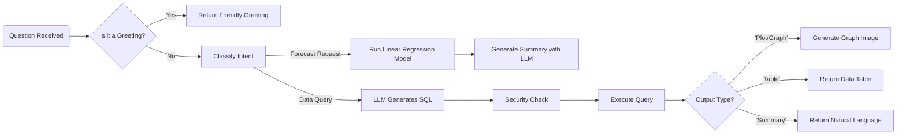

# Forecast Chatbot Project Report 🚀

> **Note:** This document contains diagrams written in **Mermaid** syntax. Use a Markdown viewer with Mermaid support (like the "Markdown Preview Mermaid Support" extension in VS Code) to visualize them.

## 1. Project Overview
Hey! This is the rundown of the **Forecast Chatbot**. Think of it as your smart data companion - it’s an AI-powered web app where you can just ask questions (by typing or speaking!) and getting answers about revenue forecasts or deep-dives into your database.

It’s built to be flexible, running on a solid Python backend and a snappy dashboard frontend, giving you the best of both worlds: interpretable math for forecasting and powerful LLMs for understanding what you mean.

## 2. How It All Fits Together (The Architecture)

Here's the tech stack in a nutshell:

*   **The Brains (Backend)**: Python running on **FastAPI** (fast by name, fast by nature) with **Uvicorn** keeping the server purring.
*   **The Face (Frontend)**: A clean HTML5/JS dashboard. It's simple, responsive, and uses Vanilla CSS so it's easy to tweak.
*   **The Memory (Database)**: SQLite databases (`forcast.db`, `your_database.db`) holding all the revenue and customer info.
*   **Security**: Good old JWT (JSON Web Tokens) to make sure only the right people get in.

### The AI Squad 🤖
We've got a few specialized models working together here:

1.  **The Listener (Vosk)**:
    *   This is our **offline speech-to-text** engine. It runs locally (using `vosk-model-small-en-us-0.15`), so your voice data doesn't need to leave the server just to be understood.

2.  **The Forecaster (Linear Regression)**:
    *   An "Explainable AI" model. Instead of a black box, we use a clear-cut **Linear Regression** model (`revenue_lr_model.joblib`). It looks at time patterns (months, days of the week) to predict where your revenue is going.

3.  **The Translator (NL2SQL)**:
    *   This part takes your English questions like "Show me the top customers" and magically turns them into SQL queries that the database understands.

4.  **The Talker (LLMs)**:
    *   We use Large Language Models to wrap everything up in nice summary sentences. You can flip a switch to use either:
        *   **Local (Ollama)**: Uses `gpt-oss:20b` for privacy and local execution.
        *   **Cloud (OpenAI-compatible)**: Uses `google/gemma-3-27b-it:free` for extra performance.

## 3. The Flow 🌊

Here is how a request travels through the system, from your voice to an answer:

```mermaid
graph TD
    User[👤 User] -->|Speaks| Mic[🎙️ Microphone]
    Mic -->|Audio| Frontend[💻 Frontend]
    Frontend -->|POST /transcribe| Vosk[🗣️ Vosk Model]
    Vosk -->|Text| API[⚡ FastAPI Backend]
    
    User -->|Types| Frontend
    Frontend -->|POST /chat| API
    
    API -->|Auth Check| Security[🔒 JWT Guard]
    Security -->|Pass| Router[🔀 Intent Router]
    
    Router -->|Greeting?| Greet[👋 Say Hello]
    Router -->|'Predict/Forecast'?| Forecast[📈 Forecast Pipeline]
    Router -->|'Show/List/Query'?| SQL[💾 NL2SQL Pipeline]
    
    Forecast -->|Result| Response[📦 JSON Response]
    SQL -->|Result| Response
    Greet -->|Result| Response
    
    Response -->|Render| UI[🖥️ User Interface]
```

### Decision Logic
When the backend gets a question, it has to decide *who* should answer it. Here's that logic:

## 4. Security & Access Control 🛡️

We don't just let anyone roam around the data.

*   **Login First**: You gotta have a key (JWT Token) to talk to the API.
*   **Role-Based Access (The Bouncer)**:
    *   Different users have different roles (e.g., `admin` vs `user`).
    *   **Forecasts**: We check if your role is allowed to see revenue data.
    *   **Queries**: If you try to ask the LLM for sensitive tables, the `allowed_tables_for_role` check steps in and blocks it if you don't have clearance.

## 5. Running the Show (Deployment)

*   **Server**: We fire up `uvicorn` to serve the app.
*   **Config**: All the secret stuff (API keys, etc.) lives in a `.env` file so it's safe and sound.
*   **Setup**: Just a `pip install` away with `requirements.txt`.

## 6. Cool Features to Note ✨
*   **Hybrid Brain**: You choose the brainpower—Privacy (Ollama) or Performance (OpenAI).
*   **Smart Charts**: Ask for a "plot" or "trend" and it generates a visual graph, not just boring text.
*   **Debug Mode**: For the curious, the UI shows exactly which model answered you and how long it took.
